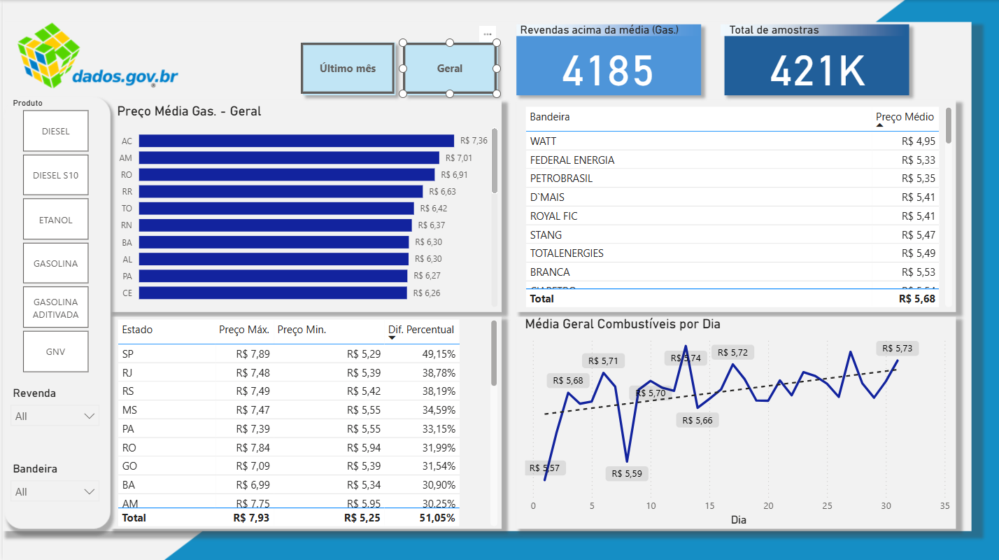

# ⛽ Operação “Tanque Cheio” — Inteligência de Mercado EcoFuel

## 📝 Contexto do Desafio
Este projeto foi desenvolvido simulando a atuação como Analista de Dados para a empresa **EcoFuel Inteligência de Mercado**, especializada na análise de preços de combustíveis no Brasil. A missão foi gerar insights e responder perguntas estratégicas a partir de uma base nacional de dados coletados em postos revendedores.

---

## 📊 O Dashboard (Visão Geral)
Abaixo está a captura de tela do painel analítico desenvolvido para este desafio:

---

## 🧠 Problemas de Negócio Respondidos
O relatório foi estruturado em Power BI para solucionar as seguintes questões de negócio:
* **Mapeamento por Estado:** Preço médio de venda da gasolina comum por estado no último mês da base.
* **Análise de Outliers:** Quantidade de revendas que vendem gasolina acima da média nacional.
* **Benchmark de Distribuição:** Identificação de qual bandeira obteve o menor preço médio por combustível.
* **Dispersão de Preços:** Diferença percentual entre o maior e o menor preço praticado de diesel em cada estado.
* **Análise Temporal:** Comportamento de preços ao longo do tempo por combustível e sazonalidade dentro do mês.
* **Volumetria:** Quantidade de amostras realizadas em todo o período analítico. *(Mais de 421 mil registros avaliados)*.

---

## 🛠️ Nível Técnico e Ferramentas
* **Processo de ETL (Power Query / M):** Engenharia de dados aplicada para extração, limpeza de nulos, transformação de tipos e carga otimizada de uma base massiva com mais de 421 mil registros.
* **Modelagem de Dados:** Estruturação de modelo relacional em esquema dimensional (Star Schema) focado em performance.
* **Linguagem DAX:** Criação de medidas calculadas customizadas para análise de dispersão percentual, contagem de linhas e médias dinâmicas.

